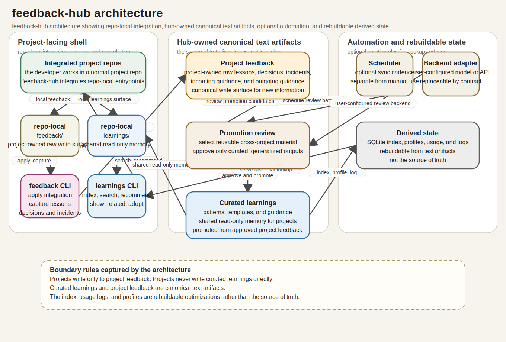

# Architecture

## What this does for you
- Gives each integrated local project a sovereign place to write feedback artifacts.
- Preserves a local curated learnings layer that can be reused across projects on the same machine.
- Prevents accidental cross-project overwrite by keeping project writes isolated.
- Keeps runtime data out of version-controlled repo history.

## Diagram
Diagram source:
- `docs/architecture.diagram.json`

Generated output:
- `docs/architecture.svg`

Refresh it with:

```bash
./scripts/render_architecture.sh --write
```

Verify it is current with:

```bash
./scripts/render_architecture.sh --check
```



## Decision Records
- `docs/adrs/README.md`
- `docs/adrs/0001-qualified-dual-branch-operating-model.md`
- `docs/adrs/0002-structured-json-artifacts-and-externalized-runtime-data.md`
- `docs/adrs/0003-managed-runtime-freshness-enforcement.md`

## Implementation details
- Version-controlled content stays in the repo checkout:
  - scripts
  - docs
  - config examples
  - architecture sources and generated diagrams
- Runtime data lives under the resolved feedback-hub data root. The exact location depends on local configuration and environment.
- The runtime data root contains:
  - per-project feedback as the ingestion layer for sovereign project artifacts
  - curated local learnings as the reusable shared memory layer
  - `.state/` as rebuildable indexes, logs, and usage state
- The target structured local artifact contract is documented in `docs/feedback-artifacts.md`.
- Some local setups may expose convenience links into that runtime data root, but those are local-only operator surfaces and are not part of the committed source tree.
- In source repositories outside `feedback-hub`, local integration paths created by this tool should stay out of that repo's version control.
- Promotion path:
  1. Project writes artifact to `projects/<project>/feedback/...`.
  2. Manager reviews and approves.
  3. Manager promotes with `learnings promote` into one of:
     - `learnings/patterns`
     - `learnings/templates`
     - `learnings/agents`
     - `learnings/anti-patterns`
- Permission model:
  - `learnings lock` enforces read-only learnings by default.
  - `learnings unlock` temporarily allows manager writes.
